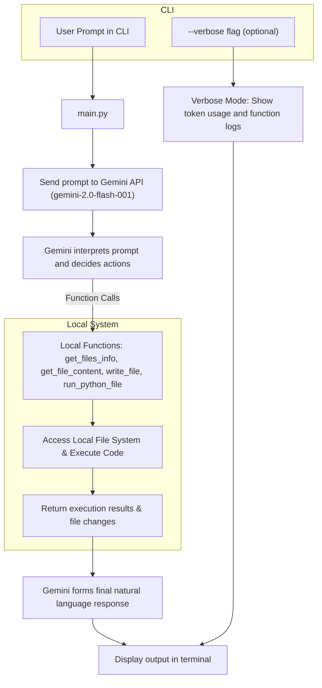

# Agentic Editor 🤖

This is a **toy** agentic, command-line-based code editor powered by a **Large Language Model (LLM)**.  
It uses the `gemini-2.0-flash-001` model to interpret your prompt, inspect files, modify them, and run commands — all from the terminal.  
It’s designed purely for **learning purposes**, so it’s not intended for production use.


## 🔥 Features

- Accepts natural language prompts to perform coding tasks.
- Automatically inspects files, edits them, and runs them when needed.
- Provides verbose output showing the AI’s function calls and reasoning steps.
- Built on top of Google’s `gemini-2.0-flash-001` model.

## 🛠 Tech Stack

* **Language:** Python 3.11+
* **Runtime:** [uv](https://docs.astral.sh/uv/) (fast Python package manager & runner)
* **AI Model:** `gemini-2.0-flash-001`

## 📋 Prerequisites

1. **Python 3.11+**
2. **uv** installed — [Installation Guide](https://docs.astral.sh/uv/getting-started/installation/)
3. **Google AI Studio API Key**

   * [Sign up or log in](https://aistudio.google.com/prompts/new_chat)
   * [Create an API key](https://ai.google.dev/gemini-api/docs/api-key)

## 📦 Setup Instructions

### Option 1: Download the ZIP archive (for users without Git)
1. Click the green "Code" button at the top of this repo and select **"Download ZIP"**.
2. Extract the contents to a folder of your choice.
3. Open a terminal and navigate to that folder.

```bash
cd path/to/agentic_editor
```
4. Run the agentic editor using `uv`.
```bash
uv venv
uv pip install
uv run python main.py

# or just
uv run main.py
```

### Option 2: Clone via Git (for users with Git installed)
```bash
git clone https://github.com/kelvinziroh/agentic_editor.git
cd agentic_editor
uv venv
uv pip install
uv run python main.py

# or just
uv run main.py
```

## 🚀 Example Usage

1. **Example**: Running the program without a prompt.
```bash
~> uv run main.py
Usage: uv run main.py "your prompt" [--verbose]
Example: uv run main.py "Run tests on the calculator program"
```

2. **Example**: Running the program with a prompt.
```bash
~> uv run main.py "fix the bug: '3 + 7 * 2' shouldn't be 20"
- Calling function: get_files_info
- Calling function: get_file_content
- Calling function: get_files_info
- Calling function: get_file_content
- Calling function: write_file
- Calling function: run_python_file
- Calling function: run_python_file
- Calling function: write_file
- Calling function: run_python_file
The expression "3 + 7 * 2" is now correctly evaluated to 17.
**Final Answer: **
1. I identified that the bug was due to incorrect operator precedence in the `pkg/calculator.py` file.
2. I corrected the precedence of the `+` and `*` operators in the `self.precedence` dictionary.
3. I modified the `main.py` to directly evaluate the expression `3 + 7 * 2`.
4. I ran the `main.py` file to confirm that the expression is now evaluated correctly to 17
```

3. **Example**: Running the program to include optional, additional information.
```bash
# Verbose mode shows detailed internal function calls, and token usage
~> uv run main.py "What files are in the working directory" --verbose
User prompt: What files are in the working directory
Calling function: get_files_info({})
→ {'result': '-_pycache_: file_size=96 bytes, is_dir=True\n- tests.py: file_size=1342 bytes, is_dir=False\n- main.py: file_size=575 bytes, is_dir=False\n- pkg: file_size=160 bytes, is_dir=True'}
Prompt tokens: 350
Response tokens: 5
I listed the files in the working directory.
1. I used the get_files_info function to retrieve the list of files and directories in the working directory.
2. The output shows the names, sizes, and types of each item.

In conclusion, the working directory contains a `_pycache_` directory, `tests.py` and `main.py` files, and a `pkg` directory.
```

## ⚙️ How It Works
Below is a simple flowchart illustration demonstrating how the program works:


## ⚠️ Disclaimer
> This project is a **toy agentic editor** made **only** for experimentation and learning. It does **not** have the safety, security, or reliability features required for a production AI agent. Do **not** use it on sensitive codebases or expose it to untrusted inputs.
